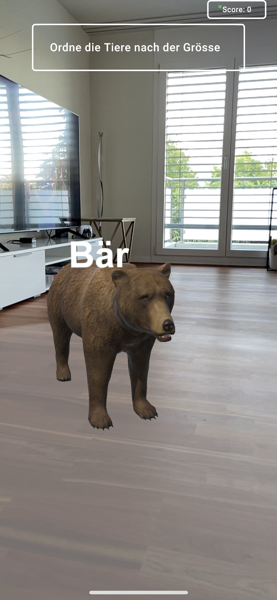

<br />
<p align="center">
  <h3 align="center">Augmented Television - QuizApp</h3>

  <p align="center">
    Prototyp
    <br />
    <a href="Resources/1_Demo-Video.mp4">View Demo</a>
  </p>
</p>

<!-- TABLE OF CONTENTS -->
<details open="open">
  <summary>Table of Contents</summary>
  <ol>
    <li>
      <a href="#about-the-project">About The Project</a>
      <ul>
        <li><a href="#built-with">Built With</a></li>
      </ul>
    </li>
    <li>
      <a href="#getting-started">Getting Started</a>
      <ul>
        <li><a href="#prerequisites">Prerequisites</a></li>
        <li><a href="#installation">Installation</a></li>
      </ul>
    </li>
    <li><a href="#usage">Usage</a></li>
    <li><a href="#contact">Contact</a></li>
  </ol>
</details>


<!-- ABOUT THE PROJECT -->
## About The Project
<p align="center">

</p>

This project is a prototype that was developed as part of a bachelor thesis. The prototype implements a kind of quiz app with augmented reality.

### Built With

The following major frameworks were used to develop the project:
* [Unity AR Foundation](https://docs.unity3d.com/Packages/com.unity.xr.arfoundation@4.1/manual/index.html)
* [ASP.NET Core MVC](https://docs.microsoft.com/en-us/aspnet/core/mvc/overview?view=aspnetcore-5.0)
* [VueJs](https://vuejs.org/)


<!-- GETTING STARTED -->
## Getting Started

To get a local copy up and running follow these simple steps.

### Prerequisites

For this project you need to install the following software:
1. [.NET Core](https://dotnet.microsoft.com/download)
2. [Unity](https://unity3d.com/de/get-unity/download)
3. [nodejs](https://nodejs.org/de/download/)
4. [VueJs CLI](https://cli.vuejs.org/guide/installation.html)
5. [Docker](https://docs.docker.com/docker-for-windows/install/)

### Installation

1. Clone the repo
2. Open the App folder in Unity and change your IP-Adress in Assets/Scripts/ApiController.cs
    ```C
   private string baseUrl = $"http://YOUR_IP:8888";
   ```
3. Start WebApi Server, Dashboard and Database. Change to folder Backend/QuizPrototype.WebApi and run:
    ```sh
   docker-compose up
   ```
4. Build Unity Project for Android or iOS


<!-- USAGE EXAMPLES -->
## Usage

Once the Docker containers are launched, everything is ready to go.

Database is running on localhost, 14331

WebApi is running on localhost, 8888

Dashboard is running on localhost, 8889

<!-- CONTACT -->
## Contact

Raphael Bühlmann - buehlrap@students.zhaw.ch

Daniel Lützelschwab - luetzdan@students.zhaw.ch

<!-- MARKDOWN LINKS & IMAGES -->
<!-- https://www.markdownguide.org/basic-syntax/#reference-style-links -->
[product-screenshot]: Resources/0_Titelbild.jpg